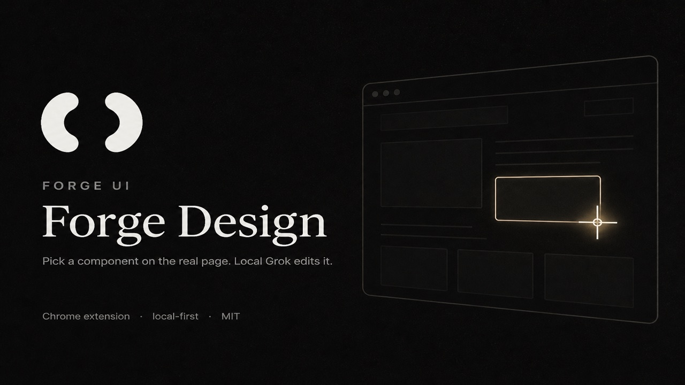
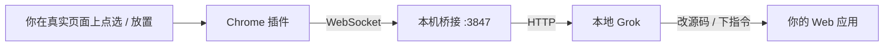

# Forge Design

<p align="center">
  
</p>

**在真实网页上点选组件，用你本地的 Grok 改界面。**

Pick a component in real Chrome. Local Grok edits it.

Forge Design 是 [Forge UI](https://forgeui.org) 的设计工具：Chrome 插件 + 本机桥接。你打开自己的应用，点一下要改的地方，侧边栏里的 Grok 带着 selector 改文案、样式、交互，或把 Forge 组件写入源码。页面内容留在本机，不经过云端。

[Forge UI](https://github.com/forge-ui/forge) · [Forge Starter](https://github.com/forge-ui/forge-starter) · [License: MIT](LICENSE)

## 为什么用

常见 AI 改 UI 的方式是截图、猜 class、或者把整页丢给云端 agent。Forge Design 走另一条路：

- **点的就是要改的。** 「选择以编辑」后，Grok 拿到真实 selector，而不是再猜一遍 DOM。
- **组件可以放到页面上。** 从侧边栏组件盘拖到锚点旁边，确认「写入源码」后写入你的项目，不是只改一遍 live DOM。
- **数据不出本机。** 桥接只听 `127.0.0.1`。截图、点选、页面文本都留在你这台机器上。
- **不抢你正在看的标签。** 默认静默模式：跳转、点击、填表在专用 agent 页签后台跑。

适合在真实 Chrome 里调试 Forge / Next 应用的人，也适合已经在用本地 Grok 的前端。

## 60 秒上手

插件只是界面。对话和改页面需要本机桥接（连你本地的 Grok）。需要已安装 Node.js 和 [Grok CLI](https://grok.x.ai)。

**1. 启动本机桥接**

```bash
curl -fsSL https://raw.githubusercontent.com/forge-ui/forge-design-extension/main/install.sh | bash
```

会安装依赖、拉起 `127.0.0.1:3847`，并在 macOS 上写成开机自启。仓库里开发可以直接 `./install.sh`。

可选：把项目 skill 装到本机 Grok，点选和改页面时不用每次重讲用法：

```bash
./install-skill.sh
```

**2. 加载 Chrome 插件**

1. 打开 `chrome://extensions`
2. 打开右上角 **开发者模式**
3. **加载已解压的扩展程序**，选带 `manifest.json` 的 `extension/` 目录
4. 点插件图标打开侧边栏

侧边栏连上服务前会显示安装命令。服务就绪后会自动连上。

**3. 改一个组件**

1. 打开你的应用页面
2. 点输入框左下角「选择以编辑」，再点页面上的目标（Esc 取消）
3. 说话，例如：「把这个按钮改成主色，文案改成保存」
4. 或者点 **+** 从组件盘放置 Forge 组件，确认后再「写入源码」

侧边栏和终端里的 Grok 共用 `~/.grok/sessions`。标题栏可拉取本机会话，点 ··· 能在 Terminal 打开当前对话。

## 工作流



1. 点「选择以编辑」，或从 **+** 组件盘放到锚点旁。
2. 本机 Grok 读取 last-pick / last-place（selector、文案、URL、testid）。
3. 多个放置点带 `#1` `#2` `#3` 时，按编号一次写完。
4. 改完后再 snapshot，确认页面上就是你要的结果。

CLI 也可以直接读刚才选中的元素：

```bash
cd server
npm run cli -- last-pick
```

## CLI

桥接起来之后，另开一个终端：

```bash
cd server
npm run cli -- status
npm run cli -- goto http://localhost:3000
npm run cli -- snapshot
```

| 命令 | 作用 |
|------|------|
| `status` | 连接状态、当前标签 |
| `tabs` | 所有标签 |
| `goto <url>` | 当前标签跳转 |
| `snapshot` | 页面文本 + 可点元素 |
| `click <selector>` | 点击 |
| `fill <sel> <text>` | 填入输入框 |
| `type <text>` | 向当前焦点输入 |
| `press Enter` | 按键 |
| `text` | 页面纯文本 |
| `wait <selector>` | 等待元素 |
| `last-pick` | 刚才点选的元素 |
| `focus` | 把 agent 页签提到前台 |

默认所有 `goto`、点击、填表都在专用 agent 页签后台执行。需要前台时传 `foreground: true` 或执行 `focus`。

## HTTP API

给其他本地 agent / 脚本用，只绑定本机：

```bash
TOKEN=$(node -e "console.log(require('./.bridge-state.json').token)" 2>/dev/null || python3 -c 'import json;print(json.load(open("../.bridge-state.json"))["token"])')

curl -s -X POST http://127.0.0.1:3847/command \
  -H "Authorization: Bearer $TOKEN" \
  -H 'Content-Type: application/json' \
  -d '{"command":"status"}'
```

## 安全

- 服务只监听 `127.0.0.1`，仅本机可访问。
- 本机 token 只存在 `.bridge-state.json`（已 gitignore）和本机 Chrome 扩展存储里，用来把插件和桥配对。
- 插件只在你自己的 Chrome 里跑；截图、点选、页面内容都留在本机。
- 发帖、付款、删数据这类操作请先确认后再执行。

## 相关项目

| 项目 | 说明 |
|------|------|
| [forge-ui/forge](https://github.com/forge-ui/forge) | Forge UI 组件库与文档，站点 [forgeui.org](https://forgeui.org) |
| [forge-ui/forge-starter](https://github.com/forge-ui/forge-starter) | 用 Forge UI 搭管理后台的开箱样板 |
| [forge-ui/forge-agent](https://github.com/forge-ui/forge-agent) | 可商用的 Agent UI |

## License

MIT
